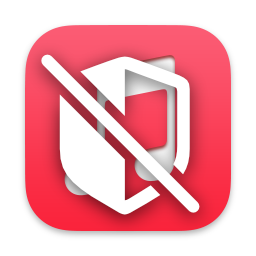

<div align="center">
             
             <h1>Music is Illegal</h1>
</div>


Disable launching of Music.app in macOS, preventing media hotkeys from being stolen. Implemented through the Endpoint Security framework for some reason...


## Installation

Grab the associated installation package (Music-is-Illegal-Installer.pkg) and install:


Next, go to System Settings -> Security & Privacy -> Full Disk Access and add the Music is Illegal application:


Finally restart the Launch Daemon (or reinstall the PKG):
```bash
sudo /bin/launchctl unload /Library/LaunchDaemons/com.khronokernel.music-is-illegal.daemon.plist
sudo /bin/launchctl load /Library/LaunchDaemons/com.khronokernel.music-is-illegal.daemon.plist
```

For application updates, the Full Disk Access workflow is not necessary. Just install the new package.